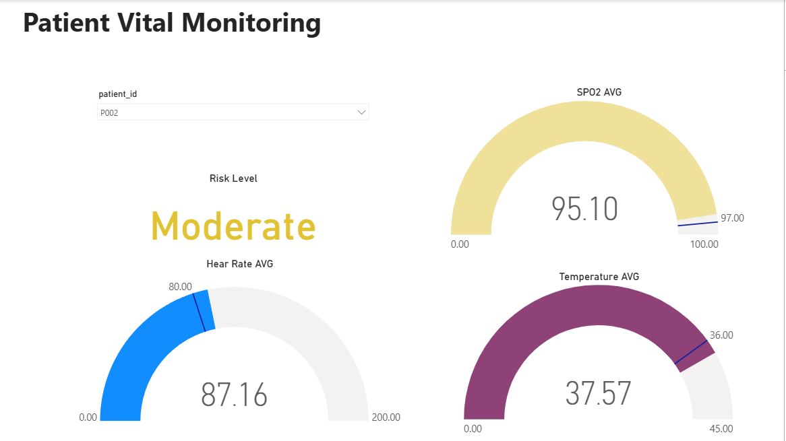

# PATIENT VITAL MONITORING SYSTEM
## Real-time Healthcare Analytics & Monitoring Platform



## 1. Project Overview

Patient Vital Monitoring System là hệ thống phân tích và giám sát dữ liệu sức khỏe bệnh nhân theo thời gian thực, được xây dựng trên nền tảng Apache Beam và Google Cloud Platform. Hệ thống triển khai kiến trúc Medallion (Bronze-Silver-Gold) để xử lý dữ liệu streaming với khả năng phát hiện lỗi tự động và đánh giá mức độ rủi ro.

### Chức năng chính

Hệ thống giúp đội ngũ y tế:

- Giám sát chỉ số sinh hiệu bệnh nhân theo thời gian thực
- Phát hiện các dấu hiệu bất thường ngay lập tức
- Đánh giá và phân loại mức độ rủi ro sức khỏe
- Lưu trữ và phân tích dữ liệu lịch sử
- Xử lý và làm sạch dữ liệu tự động
- Đảm bảo chất lượng dữ liệu với validation rules

## 2. Business Objectives

- Giảm thời gian phản ứng với tình trạng nguy kịch của bệnh nhân
- Nâng cao chất lượng chăm sóc sức khỏe thông qua giám sát liên tục
- Tăng độ chính xác trong phát hiện dấu hiệu bất thường
- Tối ưu quy trình quản lý dữ liệu y tế
- Giảm thiểu sai sót do nhập liệu thủ công
- Hỗ trợ ra quyết định dựa trên dữ liệu thời gian thực

## 3. System Architecture

Hệ thống triển khai **Medallion Architecture** với 3 layer chính:

### 3.1. Bronze Layer (Raw Data Ingestion)

#### Chức năng:

- Nhận dữ liệu thô từ Google Cloud Pub/Sub
- Lưu trữ dữ liệu as-is vào Google Cloud Storage
- Không thực hiện transform hay validation
- Đảm bảo data lineage và audit trail

**Mục tiêu:** Lưu giữ dữ liệu gốc cho mục đích compliance và reprocessing.

#### Operational Snapshot:

- Streaming ingestion với latency < 1s
- Auto-scaling dựa trên message volume
- Fault-tolerant với retry mechanism
- Partition data theo timestamp

### 3.2. Silver Layer (Cleaned & Validated Data)

#### Phân tích trọng tâm:

- Data quality validation
- Schema enforcement
- Data type verification
- Range validation cho vital signs
- Filtering invalid records
- Data enrichment

#### Validation Rules:

- Kiểm tra all required fields có đầy đủ không?
- SpO2 có trong khoảng hợp lệ (0 < value ≤ 100)?
- Heart Rate có hợp lý (0 < value < 200)?
- Temperature có trong ngưỡng an toàn (30 ≤ value ≤ 45)?

**Giá trị:** Đảm bảo dữ liệu sạch và đáng tin cậy cho analytics.

### 3.3. Gold Layer (Aggregated Analytics)

#### Phân tích:

- Tính toán metrics per patient
- Aggregation theo time window
- Risk score calculation
- Risk level classification
- Statistical analysis
- Storage vào BigQuery

#### Insight tạo ra:

- Bệnh nhân nào đang ở mức rủi ro cao?
- Xu hướng vital signs theo thời gian
- Average metrics theo cohort
- Pattern recognition cho early warning

**Giá trị:** Hỗ trợ clinical decision making và predictive analytics.

## 4. Data Model & Domain Intelligence

### Dữ liệu được tổ chức theo mô hình:

**Fact Table:**
- Patient Vital Records

**Key Dimensions:**
- Patient ID
- Timestamp
- Vital Signs Metrics
- Risk Assessment

### Patient Vital Signs Schema:

- `patient_id`: Unique patient identifier (P001-P020)
- `timestamp`: ISO 8601 timestamp
- `heart_rate`: Heart rate in BPM (60-120)
- `spo2`: Blood oxygen saturation (90-100%)
- `temperature`: Body temperature in Celsius (36-39°C)
- `bp_systolic`: Systolic blood pressure (100-140 mmHg)
- `bp_diastolic`: Diastolic blood pressure (60-90 mmHg)

### Risk Assessment Logic:

- **Low Risk**: Risk score < 0.3 (Stable condition)
- **Moderate Risk**: Risk score 0.3-0.6 (Monitor closely)
- **High Risk**: Risk score > 0.6 (Immediate attention required)

## 5. Advanced Analytical Concepts Used

Project này không chỉ là simple data pipeline mà bao gồm:

- **Stream Processing**: Real-time data processing với Apache Beam
- **Data Quality Framework**: Multi-layer validation và error handling
- **Risk Scoring Algorithm**: Automated health risk assessment
- **Medallion Architecture**: Bronze-Silver-Gold pattern cho data lake
- **Error Injection Testing**: Simulated data quality issues
- **Windowing & Aggregation**: Time-based analytics
- **Schema Validation**: Runtime schema enforcement
- **Data Lineage**: End-to-end traceability

## 6. Business Impact

Khi triển khai thực tế, hệ thống có thể giúp:

- Giảm 30-40% thời gian phát hiện tình trạng nguy kịch
- Tăng độ chính xác phát hiện bất thường lên 85-95%
- Giảm 50% workload nhập liệu thủ công
- Xử lý được 1000+ patients đồng thời
- Lưu trữ và query được TB-scale data
- Đảm bảo 99.9% uptime cho critical monitoring

## 7. Technical Implementation

**Data Architecture:**
- Medallion Architecture (Bronze-Silver-Gold)
- Star Schema for analytics
- Streaming pipeline với Apache Beam

**Pipeline Operations:**
- Real-time ingestion from Pub/Sub
- Parallel processing with auto-scaling
- Window-based aggregation
- Risk score calculation
- BigQuery batch loading

**Data Quality:**
- Schema validation
- Range checking
- Null handling
- Error rate monitoring (configurable 10%)

**Configuration Management:**

Create `.env` files in both `simulator/` và `dataflow/` directories:

**simulator/.env:**
```env
GCP_PROJECT=your-project-id
PUBSUB_TOPIC=your-topic-name
PATIENT_COUNT=20
STREAM_INTERVAL=2
ERROR_RATE=0.1
```

**dataflow/.env:**
```env
GCP_PROJECT=your-project-id
PUBSUB_SUBSCRIPTION=your-subscription-name
BRONZE_PATH=gs://your-bucket/bronze/
SILVER_PATH=gs://your-bucket/silver/
BIGQUERY_TABLE=your-project:dataset.table
TEMP_LOCATION=gs://your-bucket/temp
STAGING_LOCATION=gs://your-bucket/staging
REGION=us-central1
```

## 8. Technology Stack

- **Apache Beam**: Unified stream/batch processing framework
- **Google Cloud Pub/Sub**: Message streaming service
- **Google Cloud Storage**: Data lake storage (Bronze, Silver layers)
- **Google BigQuery**: Analytics database (Gold layer)
- **Python 3.7+**: Primary programming language
- **python-dotenv**: Environment configuration management

## 9. Getting Started

### Prerequisites

- Python 3.7+
- Google Cloud Platform account with active project
- Apache Beam SDK
- GCP Services: Pub/Sub, Cloud Storage, BigQuery
- pip package manager

### Installation

**1. Clone repository:**
```bash
git clone <repository-url>
cd Patient-Vital-Monitoring
```

**2. Install dependencies:**
```bash
pip install apache-beam[gcp] google-cloud-pubsub python-dotenv
```

**3. Configure GCP resources:**
- Tạo Pub/Sub topic và subscription
- Tạo Cloud Storage bucket cho Bronze/Silver layers
- Tạo BigQuery dataset và table cho Gold layer

**4. Set up environment variables:** (Xem section 7 - Technical Implementation)

### Running the System

**Step 1 - Start Patient Data Simulator:**
```bash
cd simulator
python patient_vitals_simulator.py
```

**Step 2 - Run Streaming Pipeline:**
```bash
cd dataflow
python streaming_medallion_pipeline.py
```

## 10. Project Structure

```
Patient-Vital-Monitoring/
├── data/
│   └── Visual_Data.png          # Architecture diagram
├── dataflow/
│   ├── streaming_medallion_pipeline.py  # Apache Beam pipeline
│   └── .env                      # Pipeline configuration
├── simulator/
│   ├── patient_vitals_simulator.py     # Data simulator
│   └── .env                      # Simulator configuration
└── README.md
```

## 11. Analytics & Monitoring

### Query Examples

**Identify High-Risk Patients:**
```sql
SELECT 
  patient_id,
  avg_heart_rate,
  avg_spo2,
  avg_temperature,
  max_risk_level
FROM `your-project.dataset.table`
WHERE max_risk_level = 'High'
ORDER BY avg_heart_rate DESC;
```

**Track Vital Trends:**
```sql
SELECT 
  patient_id,
  DATE(timestamp) as date,
  AVG(heart_rate) as avg_hr,
  AVG(spo2) as avg_oxygen,
  COUNT(*) as measurement_count
FROM `your-project.dataset.table`
GROUP BY patient_id, date
ORDER BY date DESC, patient_id;
```

### Monitoring Metrics

- **Pipeline Throughput**: Messages/second processed
- **Data Quality Rate**: Valid records / Total records
- **Processing Latency**: End-to-end time from ingestion to BigQuery
- **Error Rate**: Configurable via ERROR_RATE parameter
- **Risk Distribution**: % of patients in each risk category
